# H1-CRM-02 — создание туров, модерация и тарифные права

Дата: 04.09.2026  
Статус: контракт принят владельцем продукта; backend foundation применён на
production self-host 04.09.2026, подключение Flutter CRM продолжается.

## 1. Место документа в архитектуре

Этот документ детализирует пункт 3 порядка следующих проходов из
`h1_tourism_crm_tour_editor_tz_2026_09_03.md` и этап H1-CRM-02 из
`h1_tourism_partner_crm_unified_tz_2026_09_01.md`.

Он не создаёт второй кабинет и не меняет утверждённые визуальные решения
редактора. Общий Tourism CRM shell, роли организации, immutable Published Tour
v1, публичные страницы и медиаконтракт остаются источниками истины.

Пункт 4 — диалог с туристом, вложения и responsive-компоновка деталей заявки —
отложен до завершения этого контура. Снимки текущего состояния сохранены в
`docs/qa/tourism_lead_details_2026_09_04/`.

## 2. Результат проверки текущей реализации

Уже существует:

- `tourism_organizations` и членство `owner / manager / agent / viewer`;
- принадлежность тура через `operator_organization_id`;
- рабочий admin-редактор, сохранение тура и проверка готовности;
- immutable `tourism_experience_publications` и атомарный
  `admin_publish_tour_v1`;
- public RPC, читающий только текущую опубликованную ревизию;
- отдельная модерация медиа;
- состояния основной строки тура `draft / published / paused / archived`.

Не реализовано:

- партнёр не может безопасно создавать и редактировать собственные туры;
- запись черновика идёт напрямую в `tourism_experiences` и доступна только
  catalog admin через RLS;
- `status` редактируется как обычное поле и одновременно описывает публичную
  видимость, но не состояние проверки;
- отсутствуют отправка на проверку, замороженная версия заявки, diff,
  структурированное решение и очередь модератора;
- отсутствуют таблицы пакетов, entitlements, индивидуальных платных расширений
  и серверная функция эффективных прав;
- UI не различает запрет роли, ограничение тарифа и блокировку состоянием
  модерации.

Следовательно, существующий admin publish — хорошая основа, но не готовая
партнёрская модерация. Его нужно расширить, а не копировать.

## 3. Термины и разделение ответственности

- **Тип организации**: `tour_operator`, `winery`, `offline_point`,
  `winepool_internal`; при появлении самостоятельных агентств добавляется
  `travel_agency`. Тип бизнеса не является auth-role.
- **Роль участника**: `owner`, `manager`, `agent`, `viewer` внутри конкретной
  организации.
- **Capability**: право роли выполнить действие.
- **Entitlement**: функция, лимит или услуга, доступная по пакету либо отдельной
  покупке.
- **Review state**: состояние проверки конкретного изменения.
- **Visibility state**: виден ли уже опубликованный тур публично.

Решение всегда вычисляется как:

`membership scope AND role capability AND entitlement AND review state`.

Оплата не обходит ownership, валидацию, права на медиа или модерацию.

## 4. Целевой жизненный цикл

```mermaid
stateDiagram-v2
    [*] --> Draft: создать тур
    Draft --> Draft: сохранить / preview
    Draft --> InReview: отправить на проверку
    InReview --> ChangesRequested: вернуть с замечаниями
    ChangesRequested --> Draft: исправить
    InReview --> Approved: одобрить
    Approved --> Published: опубликовать ревизию
    Published --> Draft: создать новую редакцию
    Draft --> InReview: повторная проверка
    Published --> Paused: приостановить показ
    Paused --> Published: восстановить ту же ревизию
    Draft --> Archived: архивировать неопубликованный тур
    Published --> Archived: снять с публикации и архивировать
```



Правила:

1. Создание всегда даёт `Draft`; партнёр не задаёт публичный статус вручную.
2. Черновик можно сохранять неполным. Ошибки публикации не мешают сохранению,
   но блокируют отправку на проверку.
3. Отправка создаёт неизменяемый snapshot всей версии, включая связанные
   маршрут, посадки, авто и медиа, и блокирует именно отправленную версию.
4. Новая правка во время проверки создаётся отдельно и не изменяет snapshot,
   который видит модератор.
5. Возврат требует кодов причин по секциям и комментария. Исправления происходят
   в новом draft, замечания остаются в истории.
6. Одобрение не равно публикации. В первом релизе публикует только WinePool
   admin/moderator после успешной серверной компиляции.
7. Публикация создаёт следующую immutable Published Tour v1 revision и атомарно
   переключает `current_publication_id`.
8. Редактирование опубликованного тура не меняет live-версию. Посетитель видит
   прежнюю ревизию до публикации новой.
9. `Paused` скрывает публичный показ без удаления ревизии; resume возвращает ту
   же ревизию. Архивирование и срочное admin-вмешательство пишутся в audit log.

## 5. Состояния данных

Текущее поле `tourism_experiences.status` временно сохраняется как состояние
видимости и совместимости:

- `draft` — опубликованной ревизии ещё нет;
- `published` — текущая ревизия видима;
- `paused` — текущая ревизия временно скрыта;
- `archived` — тур выведен из рабочего оборота.

Состояние проверки нельзя добавлять в это же поле. Для него вводится отдельный
контур submissions:

- `submitted`;
- `approved`;
- `changes_requested`;
- `withdrawn`;
- `superseded`.

Состояние текущего рабочего черновика вычисляется из последней submission и
наличия более новой draft version. Это позволяет одновременно иметь live
revision, отправленную на проверку версию и следующие несохранённые в public
изменения.

## 6. Серверная модель

### 6.1. Версии и модерация

Добавить `tourism_experience_submissions`:

```text
id uuid primary key
experience_id uuid not null
organization_id uuid not null
draft_version integer not null
schema_version smallint not null default 1
content_hash text not null
payload jsonb not null
status submitted | approved | changes_requested | withdrawn | superseded
submitted_by uuid not null
submitted_at timestamptz not null
reviewed_by uuid null
reviewed_at timestamptz null
decision_codes text[] not null default '{}'
decision_comment text null
published_revision integer null
```

Ограничения:

- `(experience_id, draft_version)` уникален;
- payload и hash после отправки не обновляются;
- только активный участник владеющей организации может отправить собственный
  тур, если разрешены role capability и entitlement;
- только admin/moderator принимает решение;
- publish принимает `submission_id`, а не текущую изменяемую строку;
- повторный publish одной submission идемпотентен.

Добавить `tourism_experience_events` для append-only истории: создание,
сохранение, отправка, отзыв, решение, публикация, pause/resume, архив и экстренная
правка администратора.

В `tourism_experiences` добавить:

- `draft_version integer not null default 1`;
- `draft_updated_by uuid`;
- `latest_submission_id uuid null`;
- опциональный `archived_at`.

Поле `status` изменяется только серверными workflow RPC. Прямые partner writes
в таблицы тура и его дочерние сущности запрещены.

### 6.2. Пакеты и отдельные услуги

Добавить:

- `tourism_package_definitions(code, name, active)`;
- `tourism_package_entitlements(package_code, entitlement_code, value_json)`;
- `tourism_organization_subscriptions(organization_id, package_code, status,
  starts_at, ends_at)`;
- `tourism_organization_entitlement_overrides(organization_id,
  entitlement_code, value_json, starts_at, ends_at, reason)`.

Первые entitlement codes:

- `tour.create` — разрешение и лимит активных туров;
- `tour.self_authoring` — самостоятельное редактирование;
- `tour.submit_review` — отправка на модерацию;
- `tour.gallery_limit` — число активных медиа на тур;
- `tour.structured_content` — расширенные блоки;
- `team.seat_limit` — число участников;
- `analytics.level` — `none / basic / extended`;
- `operations.export`;
- `service.managed_authoring` — WinePool заполняет и сопровождает контент;
- `placement.featured` — отдельное коммерческое размещение, не право
  самостоятельной публикации.

Пакеты являются только удобными наборами. Любое entitlement можно подключить
отдельно на срок, не создавая новый тариф. Managed service и self-authoring могут
сосуществовать: партнёр видит черновик, комментирует и отправляет материалы, а
WinePool помогает с оформлением.

Единая security-definer функция `get_tourism_effective_capabilities` возвращает
только права текущего пользователя для выбранной организации. Все write RPC
повторно проверяют те же условия на сервере и не доверяют UI.

## 7. Матрица ролей первого релиза

| Действие | Viewer | Agent | Manager | Owner | WinePool admin |
|---|---:|---:|---:|---:|---:|
| Просмотр туров своей организации | Да | Да | Да | Да | Все организации |
| Создать черновик | Нет | Да* | Да* | Да* | Да |
| Редактировать черновик | Нет | Да* | Да* | Да* | Да |
| Preview черновика | Да | Да* | Да* | Да* | Да |
| Отправить на проверку | Нет | Да* | Да* | Да* | Да |
| Отозвать до начала проверки | Нет | Свой* | Да* | Да* | Да |
| Управлять командой и пакетом | Нет | Нет | Участники | Да | Да |
| Одобрить / вернуть | Нет | Нет | Нет | Нет | Да |
| Publish / pause / resume | Нет | Нет | Нет | Нет | Да |
| Архивировать | Нет | Нет | Да* | Да* | Да |

`*` — только в своей активной организации и при наличии entitlement. Agent
получает полноценную работу с контентом, но не финансовые, командные и
модераторские полномочия.

**Уточнено 07.09.2026 к пункту 4 §15.** Строка «Управлять командой и пакетом»
раскрыта: менеджер заводит и снимает сотрудников и наблюдателей, но не трогает
владельца и других менеджеров; владелец распоряжается командой целиком, пакет
выбирает, а применяет каталог. Сама роль «менеджер» стала возможностью пакета —
в базовом её нет, там команду ведёт только владелец. Состав пакетов и цены —
[`tourism_packages_pricing_proposal_2026_09_07.md`](tourism_packages_pricing_proposal_2026_09_07.md).

## 8. Минимальные RPC

- `tourism_create_experience_draft(organization_id)`;
- `tourism_save_experience_draft(experience_id, expected_draft_version,
  patch_or_payload)`;
- `tourism_preview_experience_draft(experience_id)`;
- `tourism_submit_experience(experience_id, expected_draft_version)`;
- `tourism_withdraw_submission(submission_id)`;
- `admin_list_tourism_review_queue(filters)`;
- `admin_review_tourism_submission(submission_id, decision, codes, comment)`;
- `admin_publish_tourism_submission(submission_id)`;
- `admin_set_tourism_visibility(experience_id, published | paused | archived)`;
- `get_tourism_effective_capabilities(organization_id)`.

Существующий `admin_publish_tour_v1(experience_id)` сначала остаётся для
совместимости и seed-скриптов, затем становится внутренней функцией. Новый UI
публикует только одобренную submission.

## 9. Изменения интерфейса после подтверждения контракта

### 9.1. Партнёр

- `Добавить тур` проверяет лимит и создаёт реальный draft;
- справа показываются отдельно `Публично` и `Проверка`;
- вместо свободного dropdown статуса отображается разрешённое следующее
  действие: сохранить, preview, отправить, отозвать или исправить;
- тарифная блокировка объясняет нужную функцию и способ подключения;
- замечания модератора ведут к секции и полю, а не лежат одним общим текстом;
- для опубликованного тура явно написано: «Изменения не появятся на сайте до
  повторной проверки и публикации».

### 9.2. WinePool admin

- текущий редактор остаётся общей рабочей поверхностью;
- появляется очередь `На проверке` с организацией, автором, возрастом заявки,
  readiness и рисками;
- сравнение показывает published revision слева и submitted snapshot справа;
- доступны approve, вернуть с причинами, publish, pause/resume и audit history;
- managed service использует тот же draft и оставляет автора каждого изменения.

## 10. Порядок реализации

1. Миграция submissions, events, package/entitlement tables и capability RPC.
2. RLS/RPC: partner draft create/save/preview/submit; прямые записи закрыты.
3. Admin review queue, structured decision и publish approved submission.
4. Подключение существующего редактора к capabilities и workflow actions.
5. Partner routing в тот же Tourism CRM shell, без отдельной админки.
6. Тестовый цикл: operator, winery, agent, managed service, expired entitlement,
   rejection/resubmit и published-edit-republish.
7. Только после регрессионного QA — отдельное решение о VPS deploy.

## 11. Приёмка

- партнёр видит и изменяет только туры своих активных организаций;
- viewer и пользователь без entitlement не могут изменить данные через API;
- сохранение draft не меняет публичный payload и content hash;
- отправленный snapshot нельзя молча переписать;
- решение модерации содержит автора, время, причины и комментарий;
- опубликованная правка появляется публично только новой immutable revision;
- pause/resume не создаёт новую контентную ревизию;
- лимит тарифа и отдельная платная функция вычисляются сервером;
- agent может формировать тур при выданном entitlement, но не управляет оплатой,
  командой или публикацией;
- admin и managed service работают в том же редакторе с полным audit trail;
- существующие Published Tour v1, публичные страницы и заявки не регрессируют.

## 12. Реализация backend foundation — 04.09.2026

Применены миграции:

- `202609041200_add_tourism_partner_authoring_workflow.sql` — версии draft,
  submissions, immutable audit, пакеты, entitlements, RLS и workflow RPC;
- `202609041230_harden_tourism_authoring_governance.sql` — дополнительная
  серверная защита canonical slug, ownership, visibility, publication pointer и
  WinePool governance flags от партнёрского изменения;
- `202609041300_version_tourism_related_draft_changes.sql` — единая версия
  черновика для маршрута, посадок, автомобилей, highlights и медиа, включая
  общие библиотеки посадок и автопарка.

Перед применением создан полный backup:

- `/root/db_backups/winepool_pre_h1_crm02_20260904_191712.dump`;
- размер `7 413 612` байт;
- SHA-256
  `8439a11c1add7fb2808611f4d19559db5c536f2473604240cc4cc237058b3f2c`.

Проверка выполнена в порядке `dry-run BEGIN/ROLLBACK -> apply -> transaction
smoke -> post-check`. Smoke находится в
`supabase/tests/20260904_tourism_partner_authoring_workflow_production_smoke.sql`
и проверяет:

- отсутствие anon execute и закрытость внутренних helper-функций;
- admin submit/approve/publish и идемпотентную повторную публикацию;
- неизменяемость submitted snapshot;
- partner package/capability resolution;
- partner create/save с optimistic concurrency;
- отказ stale update и изменения governance slug;
- полный rollback тестовых туров, submissions, events и подписки.

Фактический post-check после rollback: `3` пакета, `30` entitlement records,
`0` submissions, `0` events, оба существующих тура сохранили текущую ревизию
Published Tour v1 и публичные operator/tour identity.

## 13. Подключение Flutter CRM — 04.09.2026

Редактор переведён с прямой записи `tourism_experiences` на безопасные RPC:

- создание через `tourism_create_experience_draft`;
- сохранение allowlisted patch через `tourism_save_experience_draft` с
  optimistic concurrency по `draft_version`;
- preview через `tourism_preview_experience_draft`;
- capability resolution для выбранной организации;
- чтение последней submission с учётом RLS;
- submit, withdraw, approve/return и publish approved submission.

В правой панели публичный статус отделён от состояния редактируемой версии.
Публикация напрямую из mutable-тура удалена из прикладного слоя: новый UI
публикует только одобренный immutable snapshot. Повторная отправка становится
доступна лишь после фактического изменения и увеличения `draft_version`.
Кнопка сохранения также зависит от dirty-state формы: no-op сохранение
заблокировано и больше не создаёт ложное подтверждение или лишнюю версию draft.
Действие `Отменить изменения` восстанавливает полный локальный снимок формы к
последнему успешному сохранению, включая текст, фильтры, признаки, расписание и
компоненты цены.

Статическая проверка затронутых Flutter-файлов завершена без замечаний;
профильные domain и presentation tests проходят полностью. Полная ролевая
проверка partner UI остаётся на пилот: для неё нужно отдельно назначить пакет
выбранной организации, не выдавая доступ произвольно.

## 14. Точка продолжения совместной приёмки — 05.09.2026

Принято пользователем: dirty-state сохранения, восстановление формы действием
`Отменить изменения`, загрузочная заставка Tourism с уточнённой светящейся
полосой. Макет сохранён в проекте, контракт — `winepool_design_system.md`, §11.

Следующий проход выполняется совместно с пользователем, по одному действию:

1. Открыть текущий тур и проверить состояние справа в `Публикация и модерация`.
   Сопоставить публичную страницу с сохранённым черновиком до отправки.
   Правая карточка редактора сама по себе не доказывает неизменность публикации.
2. Если черновик уже сохранён, повторно менять данные не нужно. Отправить новую
   версию и проверить переход submission на проверку, доступные действия и
   неизменность старой публичной версии.
3. Проверить модерацию и публикацию одобренного снимка; убедиться, что новая
   публичная ревизия содержит именно отправленные изменения.
4. Проверку партнёрского интерфейса провести под согласованной пилотной ролью
   и организацией с назначенным пакетом. Не выдавать новые права автоматически.

Статус этого браузерного цикла: не завершён. Ранее выполненный backend smoke
с rollback не заменяет совместную приёмку интерфейса. После цикла — анализ и
макеты деталей заявки/диалога с туристом. Решение о VPS web deploy отдельно;
в ходе фиксации заставки деплой не выполнялся.

### Защита отправки несохранённой формы — 05.09.2026

Перед отправкой на проверку редактор проверяет несохранённые изменения.
При их наличии доступны `Сохранить и отправить` и `Продолжить редактирование`.
Отправка выполняется только после успешного сохранения и получения актуального
`draft_version`; ошибка сохранения или загрузки версии останавливает отправку.
Правки, внесённые во время сохранения, остаются несохранёнными и также
останавливают отправку. Закрытие диалога ничего не сохраняет и не отправляет.

Совместная UI-проверка этого сценария завершена 05.09.2026: пользователь
подтвердил, что исправление работает. Версия на проверке не отзывалась и не
одобрялась автоматически.

Приёмка выявила отдельный случай: версия 4 остаётся на проверке после
сохранения черновика версии 5. Исправлена доступность действий: активная
проверка блокирует повторную отправку независимо от версии черновика;
`Отозвать` остаётся доступной. Статус объясняет обе версии и порядок замены.
Конфликт повторной отправки отображается понятным сообщением с обновлением
статуса, а не сырым PostgrestException. Автоматический отзыв не выполняется.

## 15. Фактическое покрытие ТЗ — 05.09.2026

Основной backend-контур и администраторский workflow выполнены, но всё ТЗ ещё
не закрыто.

Выполнено и применено:

- submissions, immutable snapshots, events, draft versioning;
- package/entitlement tables и вычисление effective capabilities;
- безопасные create/save/preview/submit/withdraw/review/publish/visibility RPC;
- RLS, ownership, optimistic concurrency и защита governance-полей;
- подключение общего Flutter-редактора к безопасному сохранению, preview,
  отправке, отзыву, возврату, одобрению и публикации snapshot;
- разделение публичного статуса и состояния модерации;
- dirty-state, отмена изменений и защита отправки несохранённой формы;
- серверный production smoke основного workflow.

Последняя защита отправки и конфликта активной версии проверена пользователем в
интерфейсе и принята: всё работает.

Статус обновлён 12.09.2026. Пункты 1–5 закрыты; фактические доказательства
пункта 4 собраны в `handoffs/tourism_crm_handoff_2026_09_12.md`.

1. ~~Полноценный partner routing в общий Tourism CRM shell и ролевая приёмка
   `owner / manager / agent / viewer`~~ — сделано 06.09.2026, см. §18.
2. ~~Отдельная административная очередь Tourism submissions~~ — сделано
   06.09.2026: кнопка `Модерация` со счётчиком, фильтры по состоянию, автор,
   возраст заявки и сигналы вместо readiness.
3. ~~Экран сравнения опубликованной ревизии с отправленным snapshot~~ —
   сделано 06.09.2026. Остаётся переход к полю замечания и история решений.
4. ~~Пользовательское управление пакетом, тарифными блокировками, командой и
   отдельными entitlement overrides~~ — завершено 07.09.2026: серверные RPC,
   экран «Организация», приглашения, роли, витрина пакетов, исключения и
   проверка ролями; при понижении партнёр выбирает туры, лишние уходят на
   паузу после отсрочки.
5. ~~Полный ролевой/регрессионный цикл из §10.6: operator, winery, agent,
   viewer, managed service, expired entitlement, rejection/resubmit,
   published-edit-republish, pause/resume/archive~~ — выполнен 07.09.2026,
   см. §20.
6. ~~VPS web deploy~~ — выпущен 12.09.2026 отдельным атомарным релизом
   `20260912_160315` на `admin.winepool.ru` через
   `scripts/deploy_admin_web.ps1`; FTP-деплой публичного сайта с ним не
   смешивался. Активный симлинк, `.last_build_id`, `nginx -t` и защищённый
   endpoint (`401` Basic Auth) проверены после переключения.

Исторический список на момент 05.09.2026:

пункты 4–6 были открыты. Их статус выше заменяет эту историческую оценку.

Отдельный продуктовый проход по деталям заявки закрыт 06.09.2026 и принят
владельцем: широкая двухколоночная панель поверх списка, двухстрочная шапка с
действиями на узкой ширине, закреплённая строка ответа, вложения оператора с
показом у туриста, правка и удаление сообщений с историей правок. Подробности —
в `docs/handoffs/tourism_crm_handoff_2026_09_05.md`. К объёму H1-CRM-02 он не
относился и на список выше не влияет.

## 16. Очередь модерации и сравнение версий — 06.09.2026

Пункты 2 и 3 из §15 закрыты.

Функция `admin_list_tourism_review_queue` существовала, но отдавала голые
идентификаторы и тащила payload в список. Переписана: имя автора и решавшего,
версия черновика на сейчас, текущая опубликованная ревизия и три сигнала.

Про «readiness и риски» из §9.2. Отправка невозможна, пока компиляция даёт
ошибки, поэтому присланный снимок валиден по построению и список ошибок в
очереди всегда был бы пуст. Полезны другие признаки, их и показываем:

- первая публикация — сравнивать не с чем;
- партнёр продолжил править черновик после отправки, значит присланное уже
  разошлось с тем, что он видит у себя;
- какие разделы тура отличаются от опубликованного.

Сравнение (`admin_tourism_submission_diff`) показывает опубликованную ревизию
слева, присланный снимок справа и только изменившиеся разделы. Значения
приводятся к читаемому виду: служебные поля снимка скрыты, суммы переведены из
копеек в рубли, ключи названы по-русски.

Отдельно: раздел может попасть в список изменённых из-за скрытых служебных
полей. Тогда обе панели совпадают, и модератор искал бы несуществующее
различие — такой раздел помечается «Содержательных изменений нет».

Решения из очереди не дублируются: панель публикации в редакторе уже умеет
`Вернуть`, `Одобрить`, `Отозвать` и предпросмотр, поэтому карточка очереди даёт
`Открыть тур` и приводит модератора туда. Это соответствует §9.2: «текущий
редактор остаётся общей рабочей поверхностью».

Проверено в браузере под администратором на живых данных: счётчик, фильтры,
сигналы, сравнение и переход к туру. Ни одно решение не принималось.

Не проверено: фильтр по организациям на нескольких организациях — в базе одна;
и вид первой публикации — оба тура уже публиковались.

## 17. Итог сессии 06.09.2026

Полный круг пройден на живых данных дважды: партнёрская отправка → одобрение →
публикация. «Дегустация вин в Массандре» опубликована ревизией 5 из версии 7,
«Тайны Инкермана» — ревизией 5 из версии 1.

Сверх пунктов 2 и 3 закрыто:

- **Пауза и архив.** `admin_set_tourism_visibility` существовала в базе и в
  репозитории, но из интерфейса не вызывалась: фильтры `На паузе` и `Архив`
  были, а положить в них тур было нечем. Действия добавлены в меню карточки
  тура; публичная карточка не переиздаётся, новой ревизии не возникает.
- **Несохранённые правки.** Переключение вкладки уничтожало форму вместе с
  введённым текстом молча. Заведён реестр открытых форм, переход спрашивает.
  Тот же вопрос при смене тура и создании нового.
- **Отслеживание правок на всех вкладках.** Раньше было только в основной
  форме, поэтому кнопка сохранения выглядела активной всегда. На экране
  модерации это опаснее всего: сохранение правит черновик и уводит его от
  снимка, который модератор рассматривает.
- **Чип готовности.** Горел на каждом туре с трансфером: машины переехали в
  общую библиотеку, а вьюха списка осталась считать фотографии по старому типу
  владельца. Вьюха пересобрана, чип показывает процент.
- Удалено ~660 строк неиспользуемого второго редактора карточки тура.

### Закрытая утечка списка туров

`admin_tourism_experience_drawer` выполнялась без `security_invoker`, обходила
RLS, и права на неё были выданы ролям `anon` и `authenticated`. Замер до
правки: аноним получал оба тура и девять заявок вместе с названиями
организаций и внутренней готовностью.

Миграция `202609061200_secure_tourism_drawer_view.sql` включила
`security_invoker`, отозвала права у `anon`, оставила `authenticated` только
`select`. После правки анониму отказано, у туриста без членства заявки упали
с девяти до одной собственной, админские числа не изменились.

Остаток для пункта 1: политика «аутентифицированный читает опубликованное»
верна для публичного каталога, но партнёр в рабочем списке CRM всё ещё увидит
чужие опубликованные туры. Список нужно ограничивать явным фильтром по
организациям пользователя. Подробности — в
`docs/handoffs/tourism_crm_handoff_2026_09_06.md`.

## 18. Партнёрский вход и ролевая приёмка — 06.09.2026

Пункт 1 из §15 закрыт. Партнёр работает в том же Tourism CRM, что и каталог,
и видит в нём ровно свои организации.

### Список туров

Вьюха списка отдавала только название организации, поэтому фильтровать было
нечем: миграция `202609061400_expose_drawer_organization_id.sql` добавила
`operator_organization_id` и заново подтвердила `security_invoker` и права.

Ограничение поставлено в провайдерах, а не в экранах: оба списка туров
(`adminTourismExperiencesProvider` и `adminTourismExperienceListProvider`)
сначала ждут `tourismWorkspaceAccessProvider` и передают репозиторию список
организаций пользователя. Админ каталога передаёт `null` — ограничения нет.
Забыть фильтр на новом экране теперь нельзя.

`TourismWorkspaceAccess` — единственный источник ответа «кто этот человек в
CRM»: админ каталога или участник таких-то организаций с такими-то правами.
Права берутся с сервера по `get_tourism_effective_capabilities`, роль на
клиенте не вычисляется. `tourismOperatorAccessProvider`, который читает
роутер, теперь производный от него, а не второй запрос к участникам.

### Роль в интерфейсе

- `Добавить тур` — только при `tour.create` хотя бы в одной организации;
- `Модерация`, пауза и возврат в показ — только каталог WinePool;
- `В архив` — по `tour.archive`, то есть владельцу и менеджеру;
- `Превью` — по `tour.preview`;
- `Отправить на проверку` и `Отозвать` — по своим правам, причём сотрудник
  видит отзыв только на своей заявке;
- поле `Статус`, `Slug`, `Порядок флагмана`, `Проверенный маршрут`, `Партнёр`
  и `Рекомендуемый тур` — только у каталога: это governance-поля;
- выбор оператора у партнёра ограничен его организациями;
- вкладки тура у роли без `tour.edit` открываются только для чтения: над
  формой строка «Тур открыт только для чтения», сама форма не принимает ввод.
  Заявки и запросы под это правило не попадают, у них свои права.

Подпись под логотипом называет рабочее пространство: `Каталог WinePool` или
`Пилот ролей · Владелец`.

### Партнёрское сохранение не работало вовсе

Патч черновика всегда содержал `slug`, `is_partner`, `is_featured`,
`featured_sort` и `verified_route`. Для участника организации сервер отклоняет
такой вызов целиком (`tourism_save_experience_draft` — по списку полей,
триггер `protect_tourism_experience_governance_fields` — по строке), поэтому
любое сохранение партнёра падало с `42501`. Раньше это не всплывало: все
сохранения делал админ каталога. Теперь governance-поля уходят в патч только
от него.

### Две клетки §7, которых сервер не выполнял

Матрица проверена на пилотной организации «Пилот ролей» (пакет «Расширенный»,
по одному пользователю на роль) вызовами RPC от имени каждой роли:

- превью черновика наблюдателю было запрещено — исправлено, право получает
  любой активный участник (`202609061500_align_tourism_role_matrix.sql`);
- сотрудник мог отозвать чужую заявку — теперь только свою (там же);
- архив владельцу и менеджеру был обещан `tourism_can`, но
  `admin_set_tourism_visibility` требовала админа каталога для любого статуса —
  архив разрешён по `tour.archive`, показ и пауза остались у каталога
  (`202609061600_allow_partner_archive.sql`, там же послабление в триггере).

После правок матрица §7 выполняется полностью, включая «наблюдатель не меняет
ничего даже через API».

### Публичный каталог падал на туре без трансфера

Не относится к партнёрскому входу, найдено при проверке: публичная карточка
собирается через `jsonb_strip_nulls`, у тура без трансфера ключа `transfer` в
ответе нет, а разбор требовал объект и ронял весь список — экран «Винные туры
России» показывал «Не удалось загрузить туры». Необязательные блоки карточки
теперь разбираются мягко.

## 19. Решения владельца по итогам приёмки — 07.09.2026

### Пустой черновик после неудачного сохранения

Принято: чинить причину и дать удаление.

Создание тура теперь одна транзакция — `tourism_create_experience_draft`
принимает форму вместе с организацией и сам применяет её через
`tourism_save_experience_draft`. Не сохранилось — не создалось; проверено
вызовом с недопустимым полем: отказ есть, строки нет. Нажатие «Добавить тур»
без сохранения больше не создаёт ничего.

`tourism_discard_experience_draft` удаляет черновик, который никуда не уходил:
нет опубликованных ревизий, заявок на проверку и обращений туристов. Право —
`tour.edit`, то есть сотрудник и выше. Вместе с туром уходят его точки
маршрута, посадки, машины, фотографии этих объектов и журнал событий: журнал
существует ради того, что видел модератор или турист, а такой черновик не
видел никто. Триггер неизменяемости журнала при этом сохранён — удаление
разрешено ровно для того тура, который удаляет эта функция, по транзакционной
метке `winepool.discarded_experience_id`.

В списке действие показывается только когда сервер его примет: вьюха отдаёт
`can_discard`.

### Запросы на индивидуальный тур

Принято: закрыть до каталога, биржу отложить.

Политики `tourism_custom_tour_requests` пускали к чтению любого активного
участника любой организации, а к изменению — владельца, менеджера и сотрудника
любой организации. В запросе лежат имя, телефон, почта, мессенджер и бюджет
туриста. Партнёрского контура работы с запросами нет, поэтому доступ оставлен
каталогу; вкладка «Запросы» партнёру не показывается.

**Биржа спроса отложена, но не отменена.** Включать её следует уже с правилами:
что видно до того, как запрос взяли в работу (контакты — скрыты), кто получает
запрос первым, как фиксируется взятие и как считается вознаграждение. Решение
принимается после того, как станет виден живой поток обращений.

### Вход в кабинет

Раздел профиля, ведущий партнёра в CRM, назывался «Администрирование» — для
владельца бюро это чужая админка сервиса. Теперь раздел называется так же, как
то, куда он ведёт: `WinePool Tourism CRM`, пункт — «Мои туры и заявки». Каталог
видит прежние подписи. Инструменты разбора чеков («Псевдонимы магазинов»,
«Сервис OCR») из этого раздела у партнёра убраны: маршруты всё равно его туда
не пускали.

В левой панели кабинета под названием организации и ролью показывается учётная
запись с кружком инициалов — тем самым, каким оператора видит турист в
переписке по заявке (`tourismPersonInitials`, общий с центром поездки).
Нажатие ведёт в профиль, где можно выйти. Это для общего компьютера, за
которым работают несколько сотрудников.

### Переписка по заявке: лицо собеседника и форма разговора

Турист видел оператора буквами в кружке, а фотографии профиля не видел нигде,
хотя оператор её загружал. Теперь аватар едет вместе с заявкой и сообщением
(`avatar_url` в тех же embed'ах, что уже отдавали имя; политика `profiles`
позволяет чтение всем), а рисует его общий `TourismPersonAvatar`: фотография,
если она есть, иначе инициалы. Виджет один на обе стороны — центр поездки
туриста и кабинет оператора, — поэтому «как меня видит клиент» перестаёт быть
догадкой. В шапке кабинета стоит тот же кружок.

Заодно исправлена форма разговора: у туриста предел ширины пузыря считался от
ширины экрана (78% от 1600 больше самого окна переписки), а шапка внутри
пузыря растягивалась на всю доступную ширину — все реплики выглядели
одинаковыми полосами. Теперь предел считается от ширины переписки, ширина —
по содержимому (`IntrinsicWidth`), а подпись занимает всю ширину пузыря, чтобы
меню сообщения оставалось у правого края, как в кабинете.

## 20. Пункт 5 §15: полный круг на пилотном туре — 07.09.2026

Регрессионный прогон пошёл сценарием «партнёр доводит тур до отправки» и
сразу упёрся: партнёр вёл только три вкладки из семи, остальное писалось
прямо в таблицы, где права были у одного каталога. Решение владельца —
партнёр ведёт свой тур целиком, модерация остаётся за WinePool. Права выданы
тому, у кого `tour.edit` в организации тура, включая папку своего тура в
хранилище; состояние «одобрено» по-прежнему ставит только каталог.

### Что оказалось сломанным по дороге

- **Модератор приходил дважды и первым.** Публикация требует одобренной
  обложки, и та же проверка стояла на отправке. Партнёрская фотография
  ложится черновиком, поэтому отправить тур было нельзя, пока каталог не
  зашёл одобрить обложку заранее. Отправка и превью теперь принимают
  фотографии, ожидающие проверки; публикация отдельно проверяет, что каждая
  картинка присланного снимка одобрена.
- **Решение по фотографии двигало черновик.** Любое изменение медиатеки
  «трогало» тур и поднимало версию черновика — а значит, одобряя фотографии,
  модератор сам объявлял заявку устаревшей и терял кнопки «Одобрить» и
  «Вернуть». Версия не меняется, если у фотографии изменилось только
  состояние проверки.
- **Отклонение без причины.** Решение по каждой фотографии есть, объяснение
  писалось отдельно в комментарии к возврату. Теперь отклонение требует
  текста, причина живёт рядом с фотографией и показывается партнёру, а
  возврат заявки собирает все отклонённые фотографии в перечень.
- **Отклонённую фотографию нельзя было заменить** — причина есть, действия
  нет. Исправлено.
- **Список молчал о возврате.** Карточка тура показывает состояние заявки
  словами, рядом со статусными фильтрами появились виды «На проверке» и
  «На доработке».

### Пройденный круг

Партнёр создал тур, заполнил все семь вкладок, загрузил обложку и
фотографию галереи, собрал блок «Почему сюда едут» и отправил на проверку —
без участия каталога. Каталог вернул с замечанием, партнёр исправил и
отправил новую версию. Каталог не принял фотографию галереи с причиной «на
фото логотип клуба, а не сам тур»; партнёр увидел причину в карточке
фотографии, загрузил другую, отозвал устаревшую заявку и отправил свежую.
Каталог одобрил обе фотографии, одобрил заявку и опубликовал: ревизия 1,
тур виден в «Винных турах России», оператор «Пилот ролей» — в списке
проверенных.

### Правка опубликованного тура с переизданием — 07.09.2026

Прогнано на том же пилотном туре, без единой правки кода: контур отработал
как задумывался.

- партнёр поднял цену с 3 500 до 4 200 ₽ и сохранил: черновик версии 13, тур
  остался опубликованным, **в каталоге по-прежнему 3 500 ₽**;
- очередь модерации показала заявку с сигналом «Стоимость» — раздел, который
  изменился;
- сравнение версий: слева «Опубликовано · ревизия 1» с 3 500 ₽, справа
  «Прислано · версия 13» с 4 200 ₽, остальные разделы не показаны;
- одобрение и публикация создали ревизию 2; ревизия 1 осталась в истории
  неизменной, в каталоге появились 4 200 ₽;
- пауза убрала тур из каталога и из списка проверенных операторов, возврат в
  показ вернул. **Ревизий по-прежнему две**: события `paused` и `resumed`
  записаны отдельно и контентной ревизии не создают.

### Пакет «С сопровождением» и истёкший пакет — 07.09.2026

Оба сценария прогнаны на пилотной организации переключением подписки.

**Истёкший пакет.** Права схлопываются в пустой набор: править, создавать и
отправлять нельзя, смотреть можно. Опубликованный тур **остаётся в каталоге**,
и вкладка «Заявки» работает полностью — кнопки «В работу», «Подтвердить» и
«Отменить» активны. Это правильно: неоплата пакета не отменяет обязательств
перед туристом, который уже оставил заявку.

**Пакет «С сопровождением WinePool».** У партнёра те же права на чтение, но
причина другая, и теперь она названа своими словами: «Тур ведёт WinePool: по
пакету „С сопровождением“ карточку заполняет наш редактор. Заявки туристов
остаются за вами». Каталог при этом ведёт тур обычным образом — сохранение
прошло, в журнале автором правки записан админ каталога.

До этого обе ситуации, а с ними и «роль без права правки», говорили партнёру
одно и то же про «пакет не включает самостоятельное ведение». Теперь причин
четыре и каждая называется своей: чужая организация, роль «Наблюдатель»,
сопровождение WinePool, недействующий пакет.

Из §10.6 закрыты все сценарии: operator, agent, viewer, managed service,
expired entitlement, rejection/resubmit, withdraw, pause/resume/archive,
решение по медиа и published-edit-republish. **Пункт 5 §15 выполнен.**
